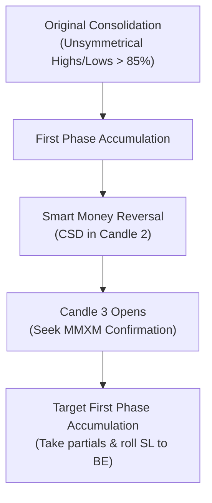
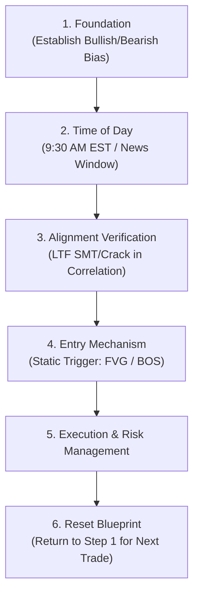

# Advanced Trading Strategy Notes: Videos 7-11 Analysis
*Author: Specialized Trading Strategy Analyst*  
*Core Content Series 2026 (Jacob Speculates)*

---

## Table of Contents
1. [Video 7: Deeper Dive Into TPD (Terminus Price Divergence)](#video-7-deeper-dive-into-tpd)
2. [Video 8: Directional Foundation (Day Trading Filtration)](#video-8-directional-foundation)
3. [Video 9: Inter Market Analysis](#video-9-inter-market-analysis)
4. [Video 10: Invalidations & Stop Placement](#video-10-invalidations--stop-placement)
5. [Video 11: Weekly Halving Theory](#video-11-weekly-halving-theory)

---

## Video 7: Deeper Dive Into TPD

### 1. Reversion Levels
Within the Terminus Price Divergence (TPD) sequence, **Reversion Levels** serve as high-probability targets and key reference areas in price. 
* **Definition**: The Reversion Level is derived from the **CSD (Change in State of Delivery)** within the **2nd Half of Candle 2** in the TPD sequence.
* **Key Mechanics**: Candle 3 within a TPD sequence often refers back to (reverts to) this specific level before starting its primary price run.
* **Wick Rule**: The Reversion Level utilizes the **entire wick** of the candle.
* **Directional Rules**:
  * **If Bullish**: Use the **lowest downclose candle** within the lower timeframe representation of Candle 2.
  * **If Bearish**: Use the **highest upclose candle** within the lower timeframe representation of Candle 2.
* **Trading Application**: The Reversion Level is specifically utilized for trading the **strongest asset** in your anticipated direction (the **Failure Swing Asset**). 
  * In a TPD, one asset runs the highs/lows of Candle 2 (the stop run), while the other asset fails to do so (the failure swing). The Reversion Level pinpointed on the failure swing asset indicates exactly where price will revert and stop in its tracks before initiating the real price run.

### 2. Reversal vs. Working TPDs
TPDs are categorized based on their timeframe and narrative focus:

| Characteristic | Reversal TPDs | Working TPDs |
| :--- | :--- | :--- |
| **Primary Timeframe** | Higher Timeframes (HTF): **H4, H6, Daily, Weekly** | Intraday Timeframes: **H1 or lower** |
| **Purpose** | Used to trade the **Higher Timeframe Narrative** | Used intraday to **predict potential future SMTs** before they occur |
| **How to Identify** | Observed via **market sentiment** (e.g., studying the daily closes and how they align) | Part of the intraday checklist (e.g., checking specific scheduled candles) |
| **Entry Application** | Establishes the macro directional bias | Reversion Level acts as a key level; entry is framed via **4-Cycle Alignment Rules** |

#### Intraday Execution with Working TPDs:
1. Identify a scheduled TPD candle (e.g., the **2:00 AM H4 TPD** during London session).
2. If no TPD is present on the H4, drop down to the H1 timeframe and monitor the **7:00 AM, 8:00 AM, or 9:00 AM** candles.
3. Look for a sequential SMT to form (e.g., between London and New York sessions).
4. Identify the strongest asset in your anticipated direction. When it hits the reversion level and respects it during the morning session, prepare for entry.
5. Use **4-Cycle Alignment** as execution triggers:
   * **Monthly Cycle**: Look for weekly SMTs on the **4H chart** (high probability with 4H TPD, but works without).
   * **Weekly Cycle**: Look for daily SMTs (between consecutive days, e.g., Mon-Tue, Tue-Wed, etc.) on the **1H chart** (high probability with 1H TPD, but works without).
   * **Daily Cycle**: Look for session-level SMTs on the **15M chart** (high probability with TPD, but works without).
   * **90-Minute Cycle**: Look for session setups on the **5M chart** during the 90-minute session.
* Note: SMT/SSMT sweeps are confluenced with TPD for high probability but work/execute *without* TPD across all cycles and timeframes.

### 3. Market Maker TPD (MMXM Integration)
High-probability **Reversal TPDs** will always exhibit a clean **Market Maker Model (MMXM)** on a lower timeframe alongside the CSD in Candle 2, providing a powerful confirmation of a "Smart Money Reversal."



* **Core Rules for MMXM TPDs**:
  1. **Immediate Identification**: The exact moment Candle 3 opens within the TPD sequence, drop down one timeframe and immediately attempt to identify the MMXM.
  2. **Original Consolidation Rule**: The original consolidation of the market model will have **unsymmetrical highs or lows over 85% of the time**.
  3. **Target Strategy**: The **First Phase Accumulation** on the sell-side/buy-side curve acts as a high-probability "easy target." Traders should take partial profits here and roll stop losses to breakeven (BE).

---

## Video 8: Directional Foundation

### 1. Directional Foundation (Predetermined Bias)
* **Definition**: Directional Foundation is the **predetermined bias** you establish coming into each trading day.
* **The "One-Way" Rule**: Once your daily bias is determined, **you must only look to trade in that direction**, regardless of what setups appear to form in the opposing direction.
* **Gauging Bias**: Daily bias is established easily through **Daily Retrospecting** (historical day-by-day analysis). 
* **Psychological Rationale**: By picking a single side of the market (either the night before or right before the session), you minimize the active trading scenarios to the absolute fewest possible. This reduces cognitive overload, minimizes emotional mistakes, prevents overtrading, and allows you to easily filter out low-probability "noise" (such as opposing cracking correlations). If a market movement does not align with your predetermined bias, **you do not execute**.

### 2. Time of Day (EST)
Time of Day introduces the **Repeatability Factor** into the strategy. High-probability setups do not occur randomly; they are bound to specific algorithmic time windows:
* **Primary Trigger Windows**: News events and primarily **9:30 AM EST** (Equities Open).
* **The Time/Price Filter**: Once the time window open occurs, you look for a **lower timeframe crack in correlation** that aligns exactly with your daily bias. 

### 3. Entry Mechanism
The entry mechanism is the final piece of the day trading blueprint. It provides objective rules for execution once Time & Price have aligned:
* **Types of Entry**:
  * **Break of Structure (BOS)**: Used for loose, trend-following confirmation.
  * **Fair Value Gaps (FVG) / Gaps**: Used for a stricter, highly mechanical approach.
* **Consistency Rule**: The entry mechanism is a **static** rule that must remain identical across all trades. While the macro setup (e.g., Daily or 90-minute cycle sequential SMT) changes dynamically, your execution trigger (e.g., a 5-minute FVG tap) must stay constant.

### 4. Bringing It All Together
The day trading filtration process is a strictly sequential blueprint:



> [!IMPORTANT]
> By strictly following this step-by-step logic, random trades are eliminated. The only variable that determines performance is risk management and self-discipline in adhering to the system.

---

## Video 9: Inter Market Analysis

### 1. The Three Triads & Asset Correlation
Inter-market analysis relies on the high-probability correlation among three key asset classes (Triads):

| Indices Triad | Forex Triad | Crypto Triad |
| :--- | :--- | :--- |
| **S&P 500 ($ES)** | **US Dollar Index ($DXY)** | **Bitcoin ($BTC)** |
| **Nasdaq ($NQ)** | **Euro ($EUR)** | **Ethereum ($ETH)** |
| **Dow Jones ($YM)** | **Great British Pound ($GBP)** | **Ripple ($XRP)** |

* **The Inverse Core Rule**: Almost all of these assets flow in close alignment with each other, **except the US Dollar ($DXY)**, which is inversely correlated:
  * **When $DXY trends lower**: Indices, Crypto, and non-USD Forex pairs ($EUR, $GBP) should trend **higher**.
  * **When $DXY trends higher**: Indices, Crypto, and non-USD Forex pairs ($EUR, $GBP) should trend **lower**.
* **Decoupling**: While temporary decoupling can occur, a high-probability market environment will show tight synchronization across all three triads.

### 2. Algorithmic Inter-Market Tricks
* **The Weekend Crypto Trick**: Because the crypto market trades **24/7** while indices close on weekends, crypto price action provides leading information. If Bitcoin ($BTC) trades **2% higher** over the weekend compared to Friday's close, you can highly expect the Indices to **gap up** significantly on Sunday's opening price. If crypto remains flat over the weekend, expect little to no gap on Sunday open.
* **$DXY Trend Gauging**: Always use the active trend of the US Dollar ($DXY) to confirm indices direction. If the dollar is trending strongly higher, seek only short setups on indices.

### 3. Inter-Market SMT Setups
* **Definition**: SMT divergence observed *between* asset classes (e.g., comparing Nasdaq highs/lows with Euro highs/lows) rather than within the same class.
* **The Restriction Rule**: **The only time inter-market analysis/SMT should be used by itself is when the primary asset class you are trading has nothing relevant tipping its hand.** (E.g., if indices are completely in sync and offer no SMT, check for SMT between Forex and Indices). Do not look for inter-market SMT constantly, as doing so leads to high failure rates.
* **High-Probability Sync Setup**: A double-confirmation setup occurs when there is a **simultaneous cracking of correlation** in two separate asset classes in the same direction:
  * *Example*: A sequential SMT forms between Nasdaq ($NQ) and Dow Jones ($YM) in Indices, **AND** a sequential SMT forms between Euro ($EUR) and GBP ($GBP) in Forex. This dual-class cracking correlation offers maximum probability for a trade.

---

## Video 10: Invalidations & Stop Placement

### 1. Invalidation Levels
* **Definition**: The specific price level at which you can confidently determine that market sentiment has little to no chance of delivering in your anticipated direction.
* **Core Rule**: To maintain a highly systematic process, **your stop loss must always be placed exactly at a technical point of invalidation**, not at an arbitrary pip/tick distance.
* **Bias Continuation**: Invalidations are equally crucial for general analysis. If a bullish HTF SMT or a daily TPD is active, you maintain a bullish bias intraday or intraweek **only as long as the lows of those setups are not invalidated**. If those lows are swept/rated on all assets in the triad, the bias is officially invalidated, order flow has flipped, and you must immediately step back and re-evaluate.

### 2. SMT Stop Placement
* **The Failure Swing Asset Rule**: When trading an SMT setup, **always execute on the Failure Swing Asset**. This asset offers a highly structured, tight invalidation level.
* **Placement Point**: The stop loss is placed at the **previous quarter's high or low (Candle 2 high/low)** where the failure swing occurred.
* **The "Against the Grain" Logic**: Price will often push slightly further against the trend (a minor stop sweep) before committing to the real directional move. If you place your stop loss at the most recent swing low upon SMT creation, you will often get stopped out prematurely. Placing it at the previous quarter's high/low of the failure swing asset ensures your trade remains active through minor noise, only closing if the entire SMT thesis is invalidated.

```
Bullish SMT Stop Loss Placement:
[Failure Swing Asset] -> Executes Trade -> Stop Loss placed safely at the low of Candle 2.
[Stop Run Asset]      --> sweeps the low of Candle 2, but Failure Swing Asset respects the low.
```

### 3. Gap Stop Placement (Fair Value Gaps)
Stop placement rules vary across three distinct Fair Value Gap (FVG) scenarios:

```
Scenario 1: Classic Large Gap
  [Candle 1]  --- FVG High ---
  [Candle 2]  (Large Expansion Candle Body) -> Place SL within Candle 2 Wick or Body (True Invalidation)
  [Candle 3]  --- FVG Low ---

Scenario 2: Smaller Lower-Half Gap
  [Candle 1]  --- FVG High ---
  [Candle 2]  (Expansion Candle)
  [Candle 3]  (Deep Wick down, creating small FVG in lower half)
  [Swing Low] ------------------------------> Place SL below the most recent Swing Low

Scenario 3: Double Gap
  [Gap 1 (First Gap)] - Closest to current price
  [Gap 2 (Second Gap)] - Further away
  [Low of Gap 2] ---------------------------> Place SL below the low/wick of the Second Gap
```

1. **Classic / Large Gap**: Characterized by massive expansion and clean, one-sided price action.
   * *Stop Placement*: Placed within the wick or body of the expansion candle (Candle 2) that formed the FVG. If price closes back through the body of this gap, order flow has flipped, making it a valid invalidation level.
2. **Smaller Lower-Half Gap**: Occurs when Candle 3 wicks deeply back into the expansion candle, leaving only a tiny FVG in the lower half.
   * *Stop Placement*: Because price has already shown a willingness to wick deeply, placing the stop at the gap is highly unsafe. The stop loss **must be placed at the most recent swing low** prior to the gap creation to give the trade room to breathe.
3. **Double Gap Scenario**: Two separate FVGs form back-to-back.
   * *Stop Placement*: The gap closest to current price is the "First Gap"; the one further away is the "Second Gap." For conservative and high-probability trading, you must allocate room for the second gap. The stop loss **must be placed below the wick/low of the Second Gap**.

---

## Video 11: Weekly Halving Theory

### 1. Weekly Halving Foundation (The 3/2 Split)
Weekly Halving Theory divides the trading week into two distinct portions to easily predict the timing of the **High of the Week (HTW)** or **Low of the Week (LTW)**:

```
           FIRST HALF OF THE WEEK               SECOND HALF
[  Sunday / Monday  |  Tuesday  |  Wednesday  ] [  Thursday  |  Friday  ]
  - Bullish Profile: LTW forms here               - Bullish Profile: HTW forms here
  - Bearish Profile: HTW forms here               - Bearish Profile: LTW forms here
```

* **The 3/2 Split Model**:
  * **First Half (Monday, Tuesday, Wednesday)**: Spans the first three trading days.
  * **Second Half (Thursday, Friday)**: Spans the final two trading days.
* **Directional Expectations**:
  * **Bullish Weekly Profile**: The **Low of the Week (LTW)** is highly likely to form during the First Half (typically Monday or Tuesday consolidation followed by a Wednesday expansion low). The **High of the Week (HTW)** is highly likely to form in the Second Half (Thursday or Friday).
  * **Bearish Weekly Profile**: The **High of the Week (HTW)** is highly likely to form during the First Half. The **Low of the Week (LTW)** is highly likely to form during the Second Half.
* **The Analytical Advantage**: Once the low of the week is established in the first half of a bullish week, you no longer need to worry about being caught on the wrong side. You have defined weekly structure and can trade with massive confidence in a single direction for the rest of the week.

### 2. Protected Price Runs
Once there is strong certainty that the LTW or HTW is established, the market will transition into one of two states: **Continuation Expansion** or **Consolidation**.

* **The Protected Low / High**: If you are bullish and the low of the week was established during the First Half (e.g., Wednesday's low), this low becomes a **"Protected Low."** It is highly shielded by algorithm pricing and should not be violated.
* **Continuation Expansion on Thursday/Friday**:
  * When the weekly halving theory aligns, Thursday and Friday will typically experience clean continuation expansion to establish the high of the week.
  * **Risk Definition**: Because Wednesday's low is a protected low, your risk is exceptionally easy to define. Your stop loss can be placed safely at the protected low (Wednesday's low) for any swing positions.
  * **Protected Price Run**: The ensuing expansion is a "Protected Price Run" drawing towards the opposing weekly liquidity.

---

> [!TIP]
> **Summary Checklist for Execution (Aligning Videos 7-11)**:
> 1. Set daily bias using **Daily Retrospecting** (Directional Foundation - Video 8).
> 2. Check the day of the week to see if we are in the **First Half or Second Half** of the weekly split to locate the weekly high/low (Weekly Halving Theory - Video 11).
> 3. Wait for the primary time window, such as **9:30 AM EST** (Time of Day - Video 8).
> 4. Verify inter-market conditions; if primary indices are unclear, check other triads like Forex for cracking correlations (Inter Market Analysis - Video 9).
> 5. Identify a **Working TPD** or **BOS** to define the setup (Video 7 & 8).
> 6. Locate the **Reversion Level** of Candle 2 to identify your key execution target on the failure swing asset (Video 7).
> 7. Objective stop-loss placement: place at the **point of invalidation** (either the previous quarter's high/low of the failure swing asset or the second gap low in double gaps) to ensure a systematic, protected run (Video 10).
